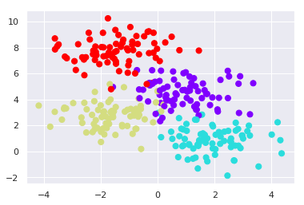
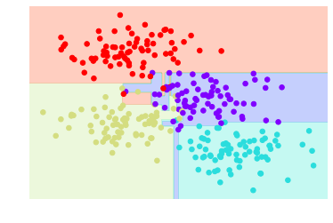
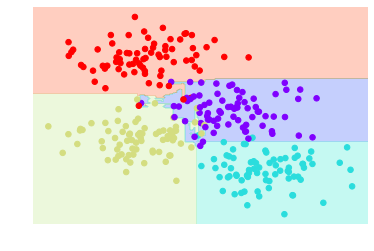
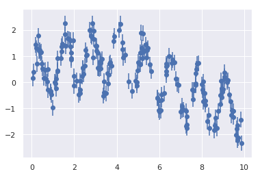
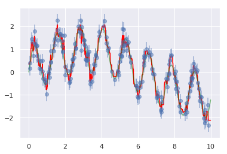
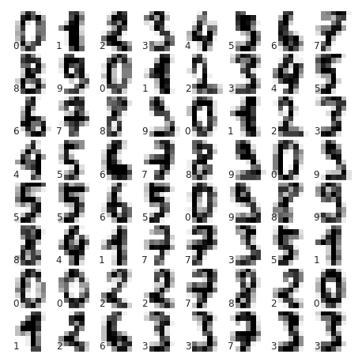
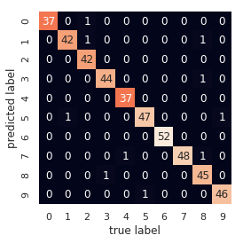

# In-Depth: Decision Trees and Random Forests


```python
%matplotlib inline
import numpy as np
import seaborn as sns; sns.set()
import matplotlib.pyplot as plt
from ipywidgets import interact

```


```python
from sklearn.datasets import make_blobs

x, y = make_blobs(n_samples=300, centers=4, random_state=0, cluster_std=1.0)
plt.scatter(x[:, 0], x[:, 1], c=y, s=50, cmap="rainbow")
plt.show()
```





```python
from sklearn.tree import DecisionTreeClassifier

tree = DecisionTreeClassifier().fit(x, y)
```


```python
def visualize_classifier(model, x, y, ax=None, cmap="rainbow"):
    ax = ax or plt.gca()
    ax.scatter(x[:, 0], x[:, 1], c=y, s=30, cmap=cmap, clim=(y.min(), y.max()), zorder=3)
    ax.axis("tight")
    ax.axis("off")
    xlim = ax.get_xlim()
    ylim = ax.get_ylim()
    
    # Ajustamos el estimador
    model.fit(x, y)
    xx, yy = np.meshgrid(np.linspace(*xlim, num=200), 
                         np.linspace(*ylim, num=200))
    z = model.predict(np.c_[xx.ravel(), yy.ravel()]).reshape(xx.shape)
    
    # Creamos el gráfico de colores con los resultados
    n_classes = len(np.unique(y))
    contours = ax.contourf(xx, yy, z, alpha=0.3, 
                           levels=np.arange(n_classes + 1) - 0.5,
                           cmap=cmap, zorder=1)
    ax.set(xlim=xlim, ylim=ylim)
```


```python
visualize_classifier(DecisionTreeClassifier(), x, y)
```





Los árboles de decisión tienden a "overfitting" los datos. Por ello se suelen usar varios árboles
de decisión conjuntamente para mejorar la clasificación.
La técnica de "Bagging" usa un ensamblado de estimadores paralelos y promedia los resultados para obtener
una mejor clasificación. Un ensamblado de árboles de decisión aleatorios es un "Random Forests"

## Juntando estimadores: Random Forests


```python
from sklearn.ensemble import BaggingClassifier

tree = DecisionTreeClassifier()
bag = BaggingClassifier(tree, n_estimators=100, max_samples=0.8, random_state=1)

bag.fit(x, y)
visualize_classifier(bag, x, y)
```





Podemos aprovechar las funcionalidades de Sklearn usando la clase RandomForestClassifier 
que se encuentra dentro del módulo "ensemble"


```python
from sklearn.ensemble import RandomForestClassifier

model = RandomForestClassifier(n_estimators=100, random_state=0, n_jobs=50)
visualize_classifier(model, x, y)
```


Los "Random Forests" también se pueden usar dentro del contexto de la regresión (variables continuas). 
Para ello usamos la clase RandomForestRegressor.


```python
rng = np.random.RandomState(42)
x = 10 * rng.rand(200)

def model(x, sigma=0.3):
    fast_oscillation = np.sin(5 * x)
    slow_oscillation = np.sin(0.5 * x)
    noise = sigma * rng.randn(len(x))
    return slow_oscillation + fast_oscillation + noise

y = model(x)
plt.errorbar(x, y, 0.3, fmt='o')
plt.show()
```





A partir de los datos anteriores, con un "Random Forest Regressor" podemos encontrar la curva que mejor se adapta.


```python
from sklearn.ensemble import RandomForestRegressor

forest = RandomForestRegressor(200)
forest.fit(x[:, None], y)

xfit = np.linspace(0, 10, 1000)
yfit = forest.predict(xfit[:, None])
ytrue = model(xfit, sigma=0)

plt.errorbar(x, y, 0.3, fmt="o", alpha=0.5)
plt.plot(xfit, yfit, "-r", color="red")
plt.plot(xfit, ytrue, "-k", alpha=0.5, color="green")
plt.show()
```





## Caso de uso: Clasificando dígitos


```python
from sklearn.datasets import load_digits

digits = load_digits()
digits.keys()
```


    dict_keys(['data', 'target', 'target_names', 'images', 'DESCR'])


```python
fig = plt.figure(figsize=(6, 6))
fig.subplots_adjust(left=0, right=1, bottom=0, top=1, hspace=0.05, wspace=0.05)

for i in range(64):
    ax = fig.add_subplot(8, 8, i + 1, xticks=[], yticks=[])
    ax.imshow(digits.images[i], cmap=plt.cm.binary, interpolation="nearest")
    ax.text(0, 7, str(digits.target[i]))
```





Ahora podemos clasificar los dígitos usando un "Random Forest"


```python
from sklearn.model_selection import train_test_split

x_train, x_test, y_train, y_test = train_test_split(digits.data, digits.target,
                                                    random_state=0)

model = RandomForestClassifier(n_estimators=1000)
model.fit(x_train, y_train)
y_predicted = model.predict(x_test)
```


```python
from sklearn import metrics

print(f"Vamos a imprimir los resultados de la clasificacion\n {metrics.classification_report(y_predicted, y_test)}")
```

    Vamos a imprimir los resultados de la clasificacion
                   precision    recall  f1-score   support
    
               0       1.00      0.97      0.99        38
               1       0.98      0.95      0.97        44
               2       0.95      1.00      0.98        42
               3       0.98      0.98      0.98        45
               4       0.97      1.00      0.99        37
               5       0.98      0.96      0.97        49
               6       1.00      1.00      1.00        52
               7       1.00      0.96      0.98        50
               8       0.94      0.98      0.96        46
               9       0.98      0.98      0.98        47
    
       micro avg       0.98      0.98      0.98       450
       macro avg       0.98      0.98      0.98       450
    weighted avg       0.98      0.98      0.98       450
    


Ahora, mostramos la matriz de confusión para obtener mejores conclusiones


```python
from sklearn.metrics import confusion_matrix

matrix = confusion_matrix(y_test, y_predicted)
sns.heatmap(matrix.T, square=True, annot=True, fmt="d", cbar=False)
plt.xlabel("true label")
plt.ylabel("predicted label")
```


    Text(89.18, 0.5, 'predicted label')





```python

```
